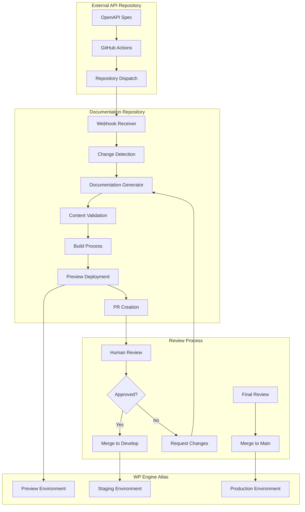

# Automation Workflows - WP Engine Customer API Documentation

## Overview

This document provides comprehensive technical specifications for the automated documentation generation and deployment system. It covers external OpenAPI spec monitoring, branching strategies, preview environments, and internal development processes.

## External OpenAPI Spec Integration

### Source Repository Monitoring

#### Repository Dispatch Method (Recommended)
```yaml
# In external API repository (.github/workflows/notify-docs.yml)
name: Notify Documentation on OpenAPI Changes
on:
  push:
    paths: 
      - 'openapi/v1.yaml'
      - 'swagger.yaml'
      - 'api-spec/**'
    branches: [main, develop]

jobs:
  notify-docs:
    runs-on: ubuntu-latest
    steps:
      - name: Get changed files
        id: changes
        uses: dorny/paths-filter@v2
        with:
          filters: |
            openapi:
              - 'openapi/v1.yaml'
              - 'swagger.yaml'
      
      - name: Repository Dispatch
        if: steps.changes.outputs.openapi == 'true'
        uses: peter-evans/repository-dispatch@v2
        with:
          token: ${{ secrets.DOCS_REPO_TOKEN }}
          repository: wpengine/customer-api-docs
          event-type: openapi-updated
          client-payload: |
            {
              "spec_url": "https://raw.githubusercontent.com/wpengine/customer-api/${{ github.ref_name }}/openapi/v1.yaml",
              "commit_sha": "${{ github.sha }}",
              "branch": "${{ github.ref_name }}",
              "changed_files": "${{ steps.changes.outputs.openapi_files }}",
              "timestamp": "${{ github.event.head_commit.timestamp }}",
              "author": "${{ github.event.head_commit.author.name }}"
            }
```

#### Webhook Alternative
```javascript
// webhook-handler.js (if using webhook approach)
export async function handleWebhook(payload) {
  const { repository, commits, ref } = payload;
  
  // Check if OpenAPI files changed
  const openApiChanged = commits.some(commit => 
    commit.modified.some(file => 
      file.includes('openapi') || file.includes('swagger')
    )
  );
  
  if (openApiChanged) {
    await triggerDocumentationUpdate({
      spec_url: `https://raw.githubusercontent.com/${repository.full_name}/${ref}/openapi/v1.yaml`,
      commit_sha: commits[0].id,
      branch: ref.replace('refs/heads/', ''),
      timestamp: commits[0].timestamp
    });
  }
}
```

### Change Detection System

#### Smart Diff Analysis
```javascript
// scripts/utils/change-detector.js
export class OpenAPIChangeDetector {
  async analyzeChanges(oldSpec, newSpec) {
    const changes = {
      endpoints: {
        added: this.findAddedEndpoints(oldSpec, newSpec),
        removed: this.findRemovedEndpoints(oldSpec, newSpec),
        modified: this.findModifiedEndpoints(oldSpec, newSpec)
      },
      schemas: {
        added: this.findAddedSchemas(oldSpec, newSpec),
        removed: this.findRemovedSchemas(oldSpec, newSpec),
        modified: this.findModifiedSchemas(oldSpec, newSpec)
      },
      breaking: this.detectBreakingChanges(oldSpec, newSpec),
      metadata: {
        version: this.compareVersions(oldSpec, newSpec),
        info: this.compareInfo(oldSpec, newSpec)
      }
    };
    
    return {
      ...changes,
      summary: this.generateChangeSummary(changes),
      impact: this.assessImpact(changes)
    };
  }
  
  detectBreakingChanges(oldSpec, newSpec) {
    const breaking = [];
    
    // Check for removed endpoints
    const removedEndpoints = this.findRemovedEndpoints(oldSpec, newSpec);
    if (removedEndpoints.length > 0) {
      breaking.push({
        type: 'removed_endpoints',
        count: removedEndpoints.length,
        endpoints: removedEndpoints
      });
    }
    
    // Check for parameter changes
    const parameterChanges = this.findParameterChanges(oldSpec, newSpec);
    breaking.push(...parameterChanges.filter(change => change.breaking));
    
    // Check for response schema changes
    const schemaChanges = this.findSchemaChanges(oldSpec, newSpec);
    breaking.push(...schemaChanges.filter(change => change.breaking));
    
    return breaking;
  }
}
```

## GitHub Actions Workflow Implementation

### Main Documentation Pipeline
```yaml
# .github/workflows/documentation-pipeline.yml
name: Documentation Generation Pipeline

on:
  repository_dispatch:
    types: [openapi-updated]
  pull_request:
    branches: [main, develop]
  push:
    branches: [main, develop]

env:
  NODE_VERSION: '18'

jobs:
  detect-changes:
    if: github.event_name == 'repository_dispatch'
    runs-on: ubuntu-latest
    outputs:
      has-changes: ${{ steps.changes.outputs.has-changes }}
      change-summary: ${{ steps.changes.outputs.summary }}
    steps:
      - uses: actions/checkout@v4
      
      - name: Download new OpenAPI spec
        run: |
          curl -o /tmp/new-spec.yaml "${{ github.event.client_payload.spec_url }}"
      
      - name: Detect changes
        id: changes
        run: |
          node scripts/detect-changes.js public/openapi/v1.yaml /tmp/new-spec.yaml
          echo "has-changes=$(cat /tmp/has-changes)" >> $GITHUB_OUTPUT
          echo "summary<<EOF" >> $GITHUB_OUTPUT
          cat /tmp/change-summary.json >> $GITHUB_OUTPUT
          echo "EOF" >> $GITHUB_OUTPUT

  generate-docs:
    needs: [detect-changes]
    if: always() && (needs.detect-changes.outputs.has-changes == 'true' || github.event_name != 'repository_dispatch')
    runs-on: ubuntu-latest
    outputs:
      preview-url: ${{ steps.deploy.outputs.preview-url }}
    steps:
      - uses: actions/checkout@v4
        with:
          token: ${{ secrets.GITHUB_TOKEN }}
          fetch-depth: 0
      
      - name: Setup Node.js
        uses: actions/setup-node@v4
        with:
          node-version: ${{ env.NODE_VERSION }}
          cache: 'npm'
      
      - name: Install dependencies
        run: npm ci
      
      - name: Update OpenAPI spec
        if: github.event_name == 'repository_dispatch'
        run: |
          curl -o public/openapi/v1.yaml "${{ github.event.client_payload.spec_url }}"
          git add public/openapi/v1.yaml
      
      - name: Generate documentation
        run: |
          npm run parse-openapi
          npm run generate-docs
          npm run update-nav
      
      - name: Validate generated content
        run: |
          npm run validate-content
          npm run build
      
      - name: Deploy to preview environment
        id: deploy
        if: github.event_name == 'pull_request' || github.event_name == 'repository_dispatch'
        uses: wpengine/github-action-wpe-site-deploy@v3
        with:
          WPE_SSHG_KEY_PRIVATE: ${{ secrets.WPE_SSHG_KEY_PRIVATE }}
          WPE_ENV: preview-${{ github.head_ref || github.run_number }}
          SRC_PATH: "dist"
          REMOTE_PATH: "/"
      
      - name: Set preview URL
        if: steps.deploy.conclusion == 'success'
        run: |
          echo "preview-url=https://preview-${{ github.head_ref || github.run_number }}.docs.wpengine.com" >> $GITHUB_OUTPUT

  create-pr:
    needs: [detect-changes, generate-docs]
    if: github.event_name == 'repository_dispatch' && needs.detect-changes.outputs.has-changes == 'true'
    runs-on: ubuntu-latest
    steps:
      - uses: actions/checkout@v4
        with:
          token: ${{ secrets.GITHUB_TOKEN }}
      
      - name: Update OpenAPI spec
        run: |
          curl -o public/openapi/v1.yaml "${{ github.event.client_payload.spec_url }}"
      
      - name: Generate documentation
        run: |
          npm ci
          npm run parse-openapi
          npm run generate-docs
          npm run update-nav
      
      - name: Create Pull Request
        uses: peter-evans/create-pull-request@v5
        with:
          token: ${{ secrets.GITHUB_TOKEN }}
          commit-message: |
            docs: update from OpenAPI spec changes
            
            Source: ${{ github.event.client_payload.spec_url }}
            Commit: ${{ github.event.client_payload.commit_sha }}
            Author: ${{ github.event.client_payload.author }}
          title: "🤖 Auto-update: OpenAPI Spec Changes (${{ github.event.client_payload.branch }})"
          body: |
            ## 🤖 Automated Documentation Update
            
            **Source Repository**: ${{ github.event.client_payload.spec_url }}
            **Source Commit**: ${{ github.event.client_payload.commit_sha }}
            **Source Branch**: ${{ github.event.client_payload.branch }}
            **Updated**: ${{ github.event.client_payload.timestamp }}
            **Author**: ${{ github.event.client_payload.author }}
            
            ### 📖 Preview Environment
            **Preview URL**: ${{ needs.generate-docs.outputs.preview-url }}
            
            ### 📊 Changes Summary
            ```json
            ${{ needs.detect-changes.outputs.change-summary }}
            ```
            
            ### ✅ Review Checklist
            - [ ] Verify new endpoints are documented correctly
            - [ ] Check code examples are working and accurate
            - [ ] Validate parameter documentation completeness
            - [ ] Test preview environment functionality
            - [ ] Review breaking changes (if any)
            - [ ] Confirm navigation structure updates
            
            ### 🚨 Breaking Changes
            ${{ contains(needs.detect-changes.outputs.change-summary, 'breaking') && '⚠️ This update contains breaking changes. Please review carefully.' || '✅ No breaking changes detected.' }}
            
            ---
            *This PR was created automatically by the documentation pipeline.*
          branch: feature/api-updates-${{ github.run_number }}
          delete-branch: true

  deploy-staging:
    if: github.ref == 'refs/heads/develop' && github.event_name == 'push'
    needs: [generate-docs]
    runs-on: ubuntu-latest
    steps:
      - name: Deploy to staging
        uses: wpengine/github-action-wpe-site-deploy@v3
        with:
          WPE_SSHG_KEY_PRIVATE: ${{ secrets.WPE_SSHG_KEY_PRIVATE }}
          WPE_ENV: wpe-docs-staging
          SRC_PATH: "dist"
          REMOTE_PATH: "/"

  deploy-production:
    if: github.ref == 'refs/heads/main' && github.event_name == 'push'
    needs: [generate-docs]
    runs-on: ubuntu-latest
    steps:
      - name: Deploy to production
        uses: wpengine/github-action-wpe-site-deploy@v3
        with:
          WPE_SSHG_KEY_PRIVATE: ${{ secrets.WPE_SSHG_KEY_PRIVATE }}
          WPE_ENV: wpe-docs-prod
          SRC_PATH: "dist"
          REMOTE_PATH: "/"
      
      - name: Notify team
        uses: 8398a7/action-slack@v3
        with:
          status: success
          text: "📚 Documentation updated and deployed to production"
          webhook_url: ${{ secrets.SLACK_WEBHOOK }}
```

## WP Engine Preview Environment Integration

### Environment Configuration
```javascript
// scripts/utils/environment-config.js
export const environments = {
  production: {
    name: 'production',
    url: 'https://docs.wpengine.com',
    wpe_env: 'wpe-docs-prod',
    branch: 'main',
    auto_deploy: true
  },
  
  staging: {
    name: 'staging',
    url: 'https://staging-docs.wpengine.com', 
    wpe_env: 'wpe-docs-staging',
    branch: 'develop',
    auto_deploy: true
  },
  
  preview: {
    name: 'preview',
    url_pattern: 'https://preview-{branch}.docs.wpengine.com',
    wpe_env_pattern: 'wpe-docs-preview-{branch}',
    branches: ['feature/*', 'auto-update/*'],
    auto_deploy: true,
    lifecycle: {
      max_age: '7 days',
      cleanup_on_merge: true,
      cleanup_on_close: true
    }
  }
};

export function getEnvironmentConfig(branch, eventType) {
  if (branch === 'main') return environments.production;
  if (branch === 'develop') return environments.staging;
  
  // Preview environment for feature branches and PRs
  return {
    ...environments.preview,
    url: environments.preview.url_pattern.replace('{branch}', sanitizeBranchName(branch)),
    wpe_env: environments.preview.wpe_env_pattern.replace('{branch}', sanitizeBranchName(branch))
  };
}

function sanitizeBranchName(branch) {
  return branch
    .replace(/[^a-zA-Z0-9-]/g, '-')
    .replace(/-+/g, '-')
    .replace(/^-|-$/g, '')
    .toLowerCase()
    .substring(0, 30);
}
```

### Preview Environment Cleanup
```yaml
# .github/workflows/cleanup-preview.yml
name: Cleanup Preview Environments

on:
  pull_request:
    types: [closed]
  schedule:
    - cron: '0 2 * * *'  # Daily at 2 AM

jobs:
  cleanup:
    runs-on: ubuntu-latest
    steps:
      - name: Cleanup closed PR environments
        if: github.event_name == 'pull_request'
        run: |
          # Remove WP Engine preview environment
          # This would integrate with WP Engine API to remove the environment
          echo "Cleaning up preview environment for PR #${{ github.event.number }}"
      
      - name: Cleanup stale environments
        if: github.event_name == 'schedule'
        run: |
          # Find and remove environments older than 7 days
          # This would query WP Engine API for preview environments
          echo "Cleaning up stale preview environments"
```

## Internal Development Documentation

### System Architecture Overview



### Component Responsibilities

#### 1. Change Detection (`scripts/utils/change-detector.js`)
- **Purpose**: Analyze differences between OpenAPI spec versions
- **Input**: Old and new OpenAPI specifications
- **Output**: Structured change report with impact analysis
- **Key Functions**:
  - `detectBreakingChanges()`: Identify backward-incompatible changes
  - `analyzeEndpointChanges()`: Track endpoint additions/modifications/removals
  - `compareSchemas()`: Detect schema definition changes

#### 2. Documentation Generator (`scripts/generate-docs.js`)
- **Purpose**: Orchestrate the complete documentation generation process
- **Dependencies**: OpenAPI parser, template engine, code example generator
- **Key Functions**:
  - `generateEndpointDocs()`: Create individual endpoint documentation
  - `updateNavigation()`: Refresh navigation structure
  - `preserveCustomContent()`: Maintain human-edited sections

#### 3. Content Validation (`scripts/validate-content.js`)
- **Purpose**: Ensure generated content meets quality standards
- **Validations**:
  - MDX syntax correctness
  - Internal link integrity
  - Code example syntax validation
  - Content marker compliance
  - Navigation consistency

#### 4. Template Engine (`scripts/utils/template-engine.js`)
- **Purpose**: Process Handlebars templates with OpenAPI data
- **Features**:
  - Variable injection with proper escaping
  - Conditional content rendering
  - Custom helper functions for formatting
  - Content marker insertion

### Error Handling & Recovery

#### Automated Recovery Procedures
```javascript
// scripts/utils/error-recovery.js
export class ErrorRecovery {
  async handleGenerationFailure(error, context) {
    const recovery = {
      'parse-error': () => this.recoverFromParseError(error, context),
      'template-error': () => this.recoverFromTemplateError(error, context),
      'validation-error': () => this.recoverFromValidationError(error, context),
      'deployment-error': () => this.recoverFromDeploymentError(error, context)
    };
    
    const errorType = this.classifyError(error);
    const recoveryAction = recovery[errorType] || this.defaultRecovery;
    
    return await recoveryAction();
  }
  
  async recoverFromParseError(error, context) {
    // Attempt to use previous known-good spec
    // Notify team of parsing issues
    // Create issue for manual intervention
  }
  
  async recoverFromValidationError(error, context) {
    // Generate report of validation failures
    // Attempt partial generation for valid content
    // Flag problematic sections for manual review
  }
}
```

#### Manual Override Procedures
1. **Emergency Documentation Updates**
   - Direct commit to `main` branch (bypass automation)
   - Manual deployment trigger
   - Post-incident review process

2. **Automation Bypass**
   - Temporary disable of automated workflows
   - Manual spec updates and generation
   - Gradual re-enablement with monitoring

### Monitoring & Observability

#### Key Metrics
- **Generation Success Rate**: Percentage of successful automated updates
- **Build Duration**: Time from trigger to deployment
- **Preview Environment Usage**: Frequency and duration of preview access
- **Review Cycle Time**: Time from PR creation to merge
- **Error Frequency**: Rate and types of generation failures

#### Alerting Strategy
```yaml
# Monitoring alerts configuration
alerts:
  generation_failure:
    condition: "build_status == 'failed'"
    severity: high
    channels: [slack, email]
    
  long_build_time:
    condition: "build_duration > 10_minutes"
    severity: medium
    channels: [slack]
    
  preview_deployment_failure:
    condition: "preview_deploy_status == 'failed'"
    severity: medium
    channels: [slack]
    
  stale_pr:
    condition: "pr_age > 3_days AND pr_status == 'open'"
    severity: low
    channels: [slack]
```

### Team Onboarding & Maintenance

#### Developer Onboarding Checklist
- [ ] Access to documentation repository
- [ ] WP Engine Atlas account and permissions
- [ ] GitHub Actions secrets and environment variables
- [ ] Understanding of content marker system
- [ ] Template modification procedures
- [ ] Emergency override procedures

#### Regular Maintenance Tasks
- **Weekly**: Review automation success rates and error logs
- **Monthly**: Update dependencies and security patches
- **Quarterly**: Review and optimize generation performance
- **Annually**: Comprehensive system architecture review

This automation system provides a robust, scalable foundation for maintaining high-quality API documentation with minimal manual intervention while preserving the ability for human expertise to enhance the generated content.
