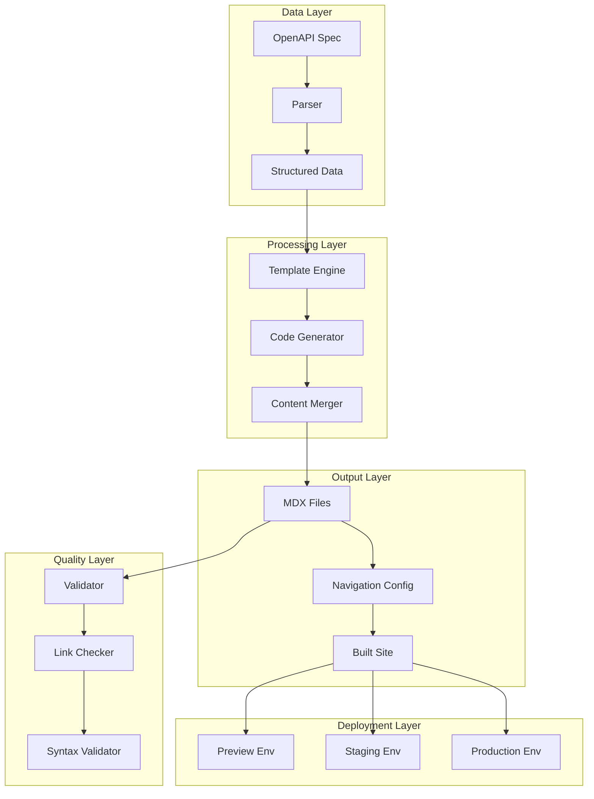

# Internal Development Documentation - WP Engine Customer API Documentation System

## System Overview

This documentation provides comprehensive guidance for developers working on the WP Engine Customer API documentation system. It covers architecture, development workflows, troubleshooting, and maintenance procedures.

## Quick Start for New Developers

### Prerequisites
- Node.js 18+ installed
- Access to WP Engine Atlas account
- GitHub repository access with appropriate permissions
- Understanding of Astro/Starlight framework basics

### Initial Setup
```bash
# Clone the repository
git clone https://github.com/wpengine/customer-api-docs.git
cd customer-api-docs

# Install dependencies
npm install

# Run the development server
npm run dev

# Test the OpenAPI parser
npm run parse-openapi

# Generate sample documentation (when implemented)
npm run generate-docs
```

### Required Environment Variables
```bash
# For WP Engine deployments
WPE_SSHG_KEY_PRIVATE=<ssh-key-for-wpe-deployment>

# For GitHub Actions
GITHUB_TOKEN=<token-with-repo-access>
DOCS_REPO_TOKEN=<token-for-external-repo-dispatch>

# For notifications (optional)
SLACK_WEBHOOK=<slack-webhook-url>
```

## Architecture Deep Dive

### Component Interaction Map



### File System Architecture

```
wpe-capi-docs/
├── .github/workflows/           # GitHub Actions workflows
│   ├── documentation-pipeline.yml  # Main automation pipeline
│   ├── cleanup-preview.yml         # Preview environment cleanup
│   ├── test-pipeline.yml           # Testing and validation
│   └── README.md                   # Workflow documentation
├── .clinerules                  # Project engineering rules
├── memory-bank/                 # Project documentation
│   ├── project_brief.md
│   ├── productContext.md
│   ├── systemPatterns.md
│   ├── techContext.md
│   ├── activeContext.md
│   ├── automationWorkflows.md
│   ├── internalDevDocs.md
│   └── progress.md
├── scripts/                     # Generation and utility scripts
│   ├── parse-openapi.js         # OpenAPI specification parser
│   ├── generate-docs.js         # Main documentation generator
│   ├── update-navigation.js     # Navigation configuration updater
│   ├── validate-content.js      # Content validation and quality checks
│   ├── detect-changes.js        # OpenAPI change detection
│   └── utils/                   # Utility modules
│       ├── code-examples.js     # Multi-language code generation
│       ├── template-engine.js   # Handlebars template processing
│       ├── file-manager.js      # File operations and comparisons
│       ├── content-markers.js   # Content marker management
│       ├── change-detector.js   # Spec change analysis
│       ├── environment-config.js # Environment configuration
│       └── error-recovery.js    # Error handling and recovery
├── templates/                   # Documentation templates
│   ├── base/                    # Base templates
│   │   ├── endpoint.mdx         # Individual endpoint template
│   │   ├── section-index.mdx    # Section overview template
│   │   └── navigation.js        # Navigation generation template
│   ├── components/              # Reusable template components
│   │   ├── parameters.mdx       # Parameter documentation
│   │   ├── responses.mdx        # Response documentation
│   │   ├── code-examples.mdx    # Code example blocks
│   │   └── error-codes.mdx      # Error documentation
│   └── partials/                # Template partials
│       ├── auth-header.mdx      # Authentication examples
│       ├── pagination-info.mdx  # Pagination documentation
│       └── rate-limit-info.mdx  # Rate limiting information
├── src/content/docs/            # Documentation content
│   ├── getting-started/         # [HUMAN-EDITABLE] User guides
│   ├── guides/                  # [HUMAN-EDITABLE] Best practices
│   ├── api-reference/           # [MIXED] API documentation
│   │   ├── overview.mdx         # [HUMAN-EDITABLE] API overview
│   │   ├── authentication.mdx   # [HUMAN-EDITABLE] Auth guide
│   │   ├── pagination.mdx       # [HUMAN-EDITABLE] Pagination guide
│   │   └── endpoints/           # [AUTO-GENERATED] Endpoint docs
│   │       ├── index.mdx        # Generated overview
│   │       ├── status/          # Status endpoints
│   │       ├── accounts/        # Account management
│   │       ├── sites/           # Site management
│   │       ├── installs/        # Installation management
│   │       ├── domains/         # Domain management
│   │       ├── backups/         # Backup operations
│   │       ├── cache/           # Cache management
│   │       ├── user/            # User operations
│   │       └── ssh-keys/        # SSH key management
│   └── try/                     # [HUMAN-EDITABLE] Interactive tools
│       └── playground.mdx       # API playground
└── public/openapi/              # OpenAPI specifications
    └── v1.yaml                  # Current API specification
```

## Development Workflows

### Adding New Template Components

1. **Create the Template**
   ```bash
   # Create new template file
   touch templates/components/new-component.mdx
   ```

2. **Define Template Structure**
   ```handlebars
   {{!-- templates/components/new-component.mdx --}}
   {{#if condition}}
   ## {{title}}
   
   {{description}}
   
   {{#each items}}
   - **{{name}}**: {{description}}
   {{/each}}
   {{/if}}
   ```

3. **Register in Template Engine**
   ```javascript
   // scripts/utils/template-engine.js
   import newComponent from '../templates/components/new-component.mdx';
   
   const templates = {
     // ... existing templates
     'new-component': newComponent
   };
   ```

4. **Test the Component**
   ```bash
   npm run generate-docs -- --test-component new-component
   ```

### Modifying Code Example Generation

1. **Update Language Templates**
   ```javascript
   // scripts/utils/code-examples.js
   generateNewLanguage(endpoint) {
     // Implementation for new language
     return generatedCode;
   }
   ```

2. **Add Language to Configuration**
   ```javascript
   const supportedLanguages = {
     // ... existing languages
     newlang: {
       extension: 'ext',
       template: 'newlang-template.hbs',
       validator: 'validate-newlang'
     }
   };
   ```

3. **Update Templates**
   ```handlebars
   {{!-- templates/base/endpoint.mdx --}}
   <Tabs>
     <!-- existing tabs -->
     <TabItem label="New Language">
       ```newlang
       {{examples.newlang}}
       ```
     </TabItem>
   </Tabs>
   ```

### Extending Validation Rules

1. **Add New Validation Function**
   ```javascript
   // scripts/validate-content.js
   async function validateNewRule(content, context) {
     // Validation logic
     return {
       passed: boolean,
       errors: [],
       warnings: []
     };
   }
   ```

2. **Register Validation Rule**
   ```javascript
   const validationRules = [
     // ... existing rules
     validateNewRule
   ];
   ```

3. **Test Validation**
   ```bash
   npm run validate-content -- --rule new-rule
   ```

## Troubleshooting Guide

### Common Issues and Solutions

#### 1. OpenAPI Parser Failures

**Symptoms**: Parser fails with YAML syntax errors
```bash
Error: YAMLException: bad indentation of a mapping entry
```

**Solutions**:
1. Validate OpenAPI spec syntax:
   ```bash
   npx swagger-parser validate public/openapi/v1.yaml
   ```

2. Check for common YAML issues:
   - Inconsistent indentation
   - Missing quotes around special characters
   - Invalid references (`$ref` paths)

3. Use fallback parser:
   ```javascript
   // In parse-openapi.js
   try {
     this.spec = yaml.load(specContent);
   } catch (error) {
     console.warn('Primary parser failed, trying fallback...');
     this.spec = yaml.load(specContent, { schema: yaml.FAILSAFE_SCHEMA });
   }
   ```

#### 2. Template Rendering Errors

**Symptoms**: Handlebars compilation fails
```bash
Error: Parse error on line 15: Expecting 'ID', 'STRING', 'NUMBER', 'BOOLEAN' or 'UNDEFINED'
```

**Solutions**:
1. Check template syntax:
   ```bash
   node -e "const hbs = require('handlebars'); hbs.compile(require('fs').readFileSync('templates/base/endpoint.mdx', 'utf8'))"
   ```

2. Validate data structure:
   ```javascript
   // Add debugging to template engine
   console.log('Template data:', JSON.stringify(data, null, 2));
   ```

3. Use safe property access:
   ```handlebars
   {{#if endpoint.parameters.path.length}}
   <!-- instead of direct access -->
   {{endpoint.parameters.path.length}}
   {{/if}}
   ```

#### 3. Code Example Generation Issues

**Symptoms**: Generated code examples are syntactically incorrect

**Solutions**:
1. Test individual language generators:
   ```bash
   node -e "
   const { CodeExampleGenerator } = require('./scripts/utils/code-examples.js');
   const gen = new CodeExampleGenerator(spec);
   console.log(gen.generateCurl(endpoint));
   "
   ```

2. Validate generated syntax:
   ```javascript
   // Add syntax validation to code generator
   const validators = {
     php: (code) => { /* PHP syntax check */ },
     python: (code) => { /* Python syntax check */ },
     javascript: (code) => { /* JS syntax check */ }
   };
   ```

#### 4. Navigation Generation Problems

**Symptoms**: Navigation structure is incorrect or missing items

**Solutions**:
1. Debug navigation data:
   ```javascript
   // In update-navigation.js
   console.log('Navigation structure:', JSON.stringify(navStructure, null, 2));
   ```

2. Validate Astro config syntax:
   ```bash
   node -c astro.config.mjs
   ```

3. Check for circular references:
   ```javascript
   // Detect circular references in navigation
   function hasCircularReference(obj, seen = new Set()) {
     // Implementation
   }
   ```

#### 5. Preview Environment Deployment Failures

**Symptoms**: WP Engine deployment fails
```bash
Error: SSH connection failed
```

**Solutions**:
1. Verify SSH key configuration:
   ```bash
   ssh-keygen -l -f ~/.ssh/wpengine_key
   ```

2. Test WP Engine connection:
   ```bash
   ssh -i ~/.ssh/wpengine_key user@environment.wpengine.com
   ```

3. Check environment naming:
   ```javascript
   // Ensure environment names follow WP Engine conventions
   function sanitizeEnvironmentName(name) {
     return name.replace(/[^a-zA-Z0-9-]/g, '-').toLowerCase();
   }
   ```

### Debugging Tools and Techniques

#### 1. Verbose Logging
```javascript
// Enable debug mode
process.env.DEBUG = 'wpe-docs:*';

// Use debug module
const debug = require('debug')('wpe-docs:generator');
debug('Processing endpoint: %s', endpoint.path);
```

#### 2. Content Inspection
```bash
# Inspect generated content
npm run generate-docs -- --dry-run --verbose

# Compare with previous version
diff -u old-content/ new-content/
```

#### 3. Template Testing
```javascript
// Test templates in isolation
const testTemplate = (templateName, data) => {
  const template = handlebars.compile(fs.readFileSync(`templates/${templateName}`, 'utf8'));
  return template(data);
};
```

## Maintenance Procedures

### Regular Maintenance Tasks

#### Weekly Tasks
1. **Review Automation Logs**
   ```bash
   # Check GitHub Actions logs
   gh run list --limit 20
   
   # Review failed builds
   gh run list --status failure
   ```

2. **Monitor Preview Environment Usage**
   ```bash
   # List active preview environments
   # (This would integrate with WP Engine API)
   curl -H "Authorization: Bearer $WPE_TOKEN" \
        "https://api.wpengine.com/v1/environments?type=preview"
   ```

3. **Validate Generated Content**
   ```bash
   npm run validate-content -- --comprehensive
   ```

#### Monthly Tasks
1. **Update Dependencies**
   ```bash
   # Check for outdated packages
   npm outdated
   
   # Update non-breaking changes
   npm update
   
   # Review and update major versions
   npm audit
   ```

2. **Performance Review**
   ```bash
   # Measure build performance
   time npm run generate-docs
   
   # Analyze bundle size
   npm run build -- --analyze
   ```

3. **Security Audit**
   ```bash
   # Run security audit
   npm audit
   
   # Check for vulnerable dependencies
   npm audit --audit-level moderate
   ```

#### Quarterly Tasks
1. **Architecture Review**
   - Review system performance metrics
   - Evaluate new features and improvements
   - Update documentation and procedures

2. **Disaster Recovery Testing**
   - Test backup and recovery procedures
   - Validate rollback mechanisms
   - Update emergency contact information

### Emergency Procedures

#### 1. Production Documentation Outage

**Immediate Response**:
1. Check system status:
   ```bash
   curl -I https://docs.wpengine.com
   ```

2. Verify WP Engine status:
   ```bash
   curl -I https://api.wpengine.com/status
   ```

3. Check recent deployments:
   ```bash
   gh run list --branch main --limit 5
   ```

**Recovery Steps**:
1. Rollback to last known good version:
   ```bash
   git revert HEAD --no-edit
   git push origin main
   ```

2. Manual deployment if automation fails:
   ```bash
   npm run build
   # Manual upload to WP Engine
   ```

3. Notify stakeholders:
   ```bash
   # Send notification via Slack webhook
   curl -X POST -H 'Content-type: application/json' \
        --data '{"text":"Documentation site restored"}' \
        $SLACK_WEBHOOK
   ```

#### 2. Automation System Failure

**Diagnosis**:
1. Check GitHub Actions status
2. Verify external repository connectivity
3. Test OpenAPI spec accessibility

**Recovery**:
1. Disable automation temporarily:
   ```yaml
   # In .github/workflows/documentation-pipeline.yml
   on:
     # Comment out triggers
     # repository_dispatch:
     #   types: [openapi-updated]
   ```

2. Manual documentation update:
   ```bash
   curl -o public/openapi/v1.yaml $EXTERNAL_SPEC_URL
   npm run generate-docs
   npm run build
   # Manual deployment
   ```

3. Gradual re-enablement with monitoring

### Performance Optimization

#### Build Performance
1. **Parallel Processing**
   ```javascript
   // Process endpoints in parallel
   const endpointPromises = endpoints.map(endpoint => 
     generateEndpointDoc(endpoint)
   );
   await Promise.all(endpointPromises);
   ```

2. **Incremental Generation**
   ```javascript
   // Only regenerate changed endpoints
   const changedEndpoints = detectChangedEndpoints(oldSpec, newSpec);
   await generateDocs(changedEndpoints);
   ```

3. **Caching Strategy**
   ```javascript
   // Cache parsed OpenAPI data
   const cacheKey = crypto.createHash('md5').update(specContent).digest('hex');
   if (cache.has(cacheKey)) {
     return cache.get(cacheKey);
   }
   ```

#### Memory Optimization
1. **Stream Processing**
   ```javascript
   // Process large specs in chunks
   const chunkSize = 10;
   for (let i = 0; i < endpoints.length; i += chunkSize) {
     const chunk = endpoints.slice(i, i + chunkSize);
     await processChunk(chunk);
   }
   ```

2. **Garbage Collection**
   ```javascript
   // Force garbage collection after heavy operations
   if (global.gc) {
     global.gc();
   }
   ```

## Team Collaboration

### Code Review Guidelines

1. **Template Changes**
   - Verify template syntax
   - Test with sample data
   - Check output formatting
   - Validate accessibility

2. **Script Modifications**
   - Ensure error handling
   - Add appropriate logging
   - Include unit tests
   - Document breaking changes

3. **Configuration Updates**
   - Test in preview environment
   - Verify backward compatibility
   - Update documentation
   - Coordinate with team

### Knowledge Sharing

1. **Documentation Updates**
   - Keep memory bank current
   - Document decisions and rationale
   - Share lessons learned
   - Update troubleshooting guides

2. **Team Communication**
   - Regular architecture reviews
   - Share performance insights
   - Discuss improvement opportunities
   - Coordinate major changes

This internal documentation provides the foundation for effective team collaboration and system maintenance. Regular updates ensure it remains current and valuable for all team members.
