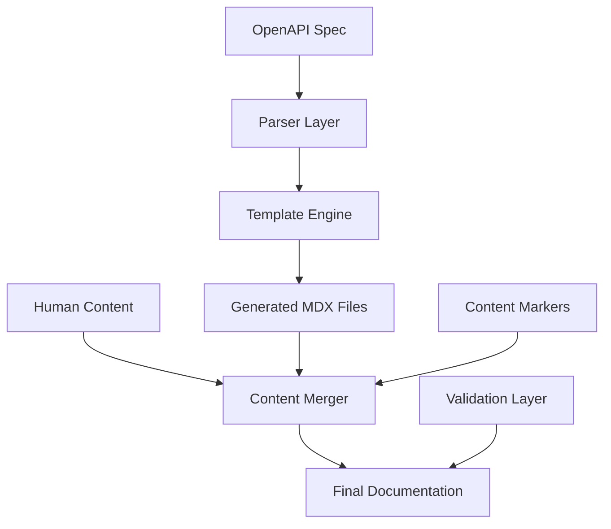
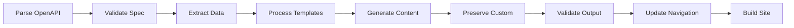

# System Patterns - WP Engine Customer API Documentation

## Content Generation Architecture

### Three-Layer Content Model



#### Layer 1: Data Extraction
- **OpenAPI Parser**: Extracts structured data from YAML specification
- **Schema Validation**: Ensures OpenAPI spec compliance
- **Data Normalization**: Converts to consistent internal format

#### Layer 2: Template Processing
- **Template Engine**: Processes MDX templates with data injection
- **Code Generation**: Creates multi-language examples
- **Content Assembly**: Combines templates with extracted data

#### Layer 3: Content Integration
- **Marker Detection**: Identifies human vs generated content boundaries
- **Content Preservation**: Maintains custom sections during regeneration
- **Conflict Resolution**: Handles overlapping content scenarios

## File Organization Patterns

### Directory Structure
```
src/content/docs/
├── getting-started/           [HUMAN-EDITABLE]
│   ├── introduction.md
│   ├── authentication.md
│   └── quick-start.md
├── guides/                    [HUMAN-EDITABLE]
│   ├── best-practices.md
│   ├── rate-limiting.md
│   └── error-handling.md
├── api-reference/
│   ├── overview.mdx           [HUMAN-EDITABLE]
│   ├── authentication.mdx     [HUMAN-EDITABLE]
│   ├── pagination.mdx         [HUMAN-EDITABLE]
│   └── endpoints/             [AUTO-GENERATED]
│       ├── index.mdx
│       ├── status/
│       ├── accounts/
│       ├── sites/
│       ├── installs/
│       ├── domains/
│       ├── backups/
│       ├── cache/
│       ├── user/
│       └── ssh-keys/
└── try/                       [HUMAN-EDITABLE]
    └── playground.mdx
```

### Content Marker System

#### File-Level Markers
```markdown
<!-- AUTO-GENERATED: Do not edit directly -->
<!-- Source: public/openapi/v1.yaml -->
<!-- Last updated: 2025-01-27T09:51:00Z -->
<!-- Generator: scripts/generate-docs.js v1.0.0 -->
```

#### Section-Level Markers
```markdown
<!-- AUTO-GENERATED-START: endpoint-summary -->
## GET /accounts/{account_id}
Returns details for a single account.
<!-- AUTO-GENERATED-END: endpoint-summary -->

<!-- CUSTOM-START: additional-notes -->
### Important Considerations
- Account access depends on user permissions
- Rate limiting applies to this endpoint
<!-- CUSTOM-END: additional-notes -->

<!-- AUTO-GENERATED-START: parameters -->
| Parameter | Type | Required | Description |
|-----------|------|----------|-------------|
| account_id | string (uuid) | yes | ID of account |
<!-- AUTO-GENERATED-END: parameters -->
```

## Template System Patterns

### Template Hierarchy
```
templates/
├── base/
│   ├── endpoint.mdx           # Base endpoint template
│   ├── section-index.mdx      # Section overview template
│   └── navigation.js          # Navigation generation
├── components/
│   ├── parameters.mdx         # Parameter table component
│   ├── responses.mdx          # Response documentation
│   ├── code-examples.mdx      # Multi-language examples
│   └── error-codes.mdx        # Error documentation
└── partials/
    ├── auth-header.mdx        # Authentication examples
    ├── pagination-info.mdx    # Pagination documentation
    └── rate-limit-info.mdx    # Rate limiting information
```

### Variable Injection Pattern
```javascript
// Template variables follow dot notation
{{endpoint.method}}           // GET, POST, PUT, DELETE, PATCH
{{endpoint.path}}             // /accounts/{account_id}
{{endpoint.operationId}}      // getAccount
{{endpoint.summary}}          // Get an account by ID
{{endpoint.description}}      // Returns a single Account
{{endpoint.tags}}             // ['account']

// Nested objects
{{endpoint.parameters.path}}  // Path parameters
{{endpoint.parameters.query}} // Query parameters
{{endpoint.responses.200}}    // Success response
{{endpoint.responses.error}}  // Error responses

// Code examples
{{examples.curl}}             // cURL example
{{examples.php}}              // PHP example
{{examples.python}}           // Python example
{{examples.nodejs}}           // Node.js example
```

## Code Example Generation Patterns

### Language-Specific Templates
```javascript
// cURL template
const curlTemplate = `
curl -X {{method}} "{{baseUrl}}{{path}}" \\
  -u "API_USER_ID:API_USER_PASSWORD"{{#if hasBody}} \\
  -H "Content-Type: application/json" \\
  -d '{{requestBody}}'{{/if}}
`;

// PHP template
const phpTemplate = `
$client = new GuzzleHttp\\Client();
$auth = base64_encode('API_USER_ID:API_USER_PASSWORD');

$response = $client->{{methodLower}}('{{baseUrl}}{{path}}'{{#if hasOptions}}, [
    'headers' => [
        'Authorization' => 'Basic ' . $auth{{#if hasBody}},
        'Content-Type' => 'application/json'{{/if}}
    ]{{#if hasBody}},
    'json' => {{requestBodyPhp}}{{/if}}
]{{/if}});
`;
```

### Authentication Pattern Injection
```javascript
// All examples include proper authentication
const authPatterns = {
  curl: '-u "API_USER_ID:API_USER_PASSWORD"',
  php: "base64_encode('API_USER_ID:API_USER_PASSWORD')",
  python: "base64.b64encode('API_USER_ID:API_USER_PASSWORD'.encode()).decode()",
  nodejs: "Buffer.from('API_USER_ID:API_USER_PASSWORD').toString('base64')"
};
```

## Navigation Generation Patterns

### Dynamic Sidebar Generation
```javascript
// Generate navigation from OpenAPI tags
const generateNavigation = (endpoints) => {
  const sections = groupByTag(endpoints);
  
  return sections.map(section => ({
    label: formatSectionName(section.tag),
    items: section.endpoints.map(endpoint => ({
      label: formatEndpointName(endpoint),
      slug: generateSlug(endpoint)
    }))
  }));
};
```

### URL Slug Patterns
```javascript
// Consistent slug generation
const slugPatterns = {
  section: (tag) => `api-reference/endpoints/${kebabCase(tag)}`,
  endpoint: (method, path) => {
    const cleanPath = path.replace(/[{}]/g, '').replace(/\//g, '-');
    return `api-reference/endpoints/${kebabCase(tag)}/${method.toLowerCase()}${cleanPath}`;
  }
};
```

## Content Preservation Patterns

### Diff-Based Updates
```javascript
// Only update changed content
const updateStrategy = {
  1. parseExistingFile(filePath),
  2. extractCustomSections(existingContent),
  3. generateNewContent(templateData),
  4. mergeCustomSections(newContent, customSections),
  5. compareWithExisting(mergedContent, existingContent),
  6. updateOnlyIfChanged(filePath, mergedContent)
};
```

### Conflict Detection
```javascript
// Detect human modifications in auto-generated sections
const conflictDetection = {
  checkMarkers: (content) => validateMarkerIntegrity(content),
  detectModifications: (content) => findUnmarkedChanges(content),
  reportConflicts: (conflicts) => generateConflictReport(conflicts),
  resolveConflicts: (conflicts) => promptForResolution(conflicts)
};
```

## Validation Patterns

### Content Validation Pipeline
```javascript
const validationPipeline = [
  validateMDXSyntax,
  validateInternalLinks,
  validateCodeExamples,
  validateMarkerIntegrity,
  validateNavigationConsistency,
  validateOpenAPICompliance
];
```

### Quality Assurance Checks
```javascript
const qualityChecks = {
  completeness: checkAllEndpointsDocumented,
  accuracy: validateExampleSyntax,
  consistency: checkFormattingStandards,
  accessibility: validateMarkdownStructure,
  performance: checkImageOptimization
};
```

## Build Process Patterns

### Generation Workflow


### Error Handling Strategy
```javascript
const errorHandling = {
  parseErrors: (error) => logAndContinue(error, 'spec-parsing'),
  templateErrors: (error) => logAndSkip(error, 'template-processing'),
  validationErrors: (error) => logAndFail(error, 'content-validation'),
  buildErrors: (error) => logAndFail(error, 'site-building')
};
```

## Deployment Integration Patterns

### Branch-Based Environments
```yaml
# Environment mapping
environments:
  main: production.docs.wpengine.com
  develop: staging.docs.wpengine.com
  feature/*: preview-{branch}.docs.wpengine.com
  auto-update/*: auto-{timestamp}.docs.wpengine.com
```

### Preview Generation
```javascript
// Automatic preview URLs for PRs
const previewPattern = {
  url: `https://preview-${branchName}.docs.wpengine.com`,
  deployment: 'ephemeral',
  lifetime: '7 days',
  access: 'authenticated'
};
